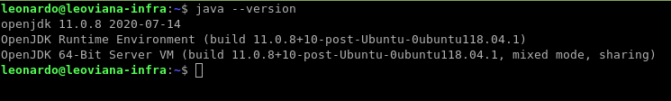
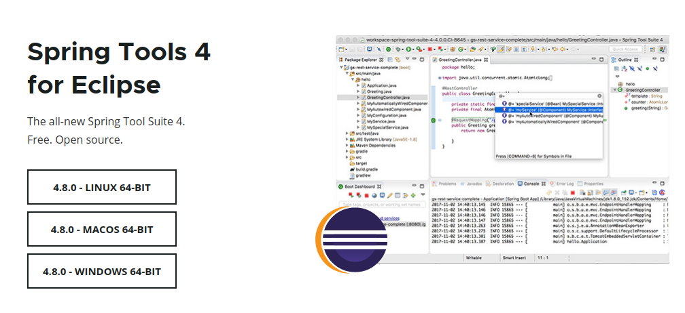
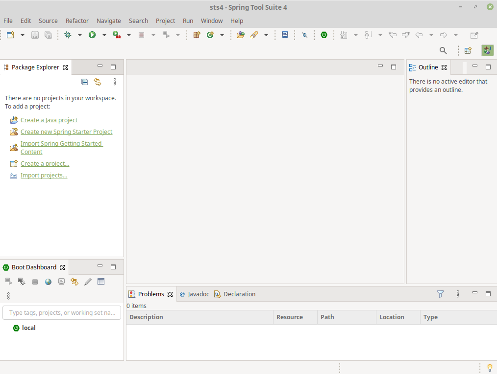
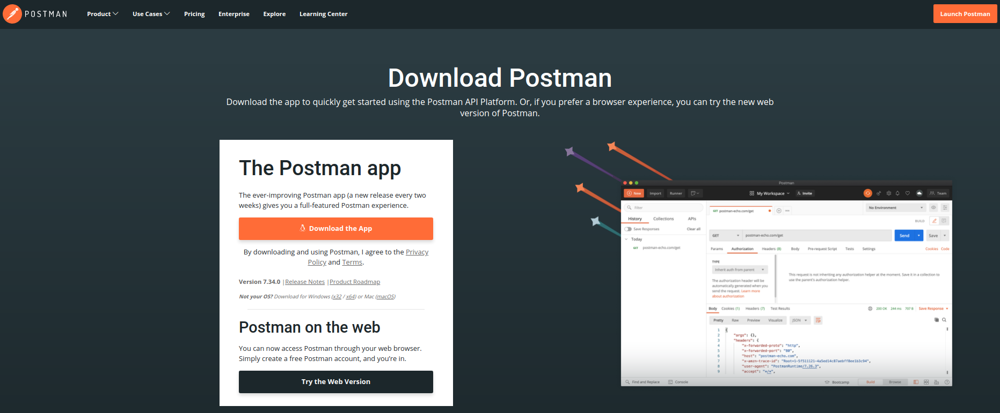
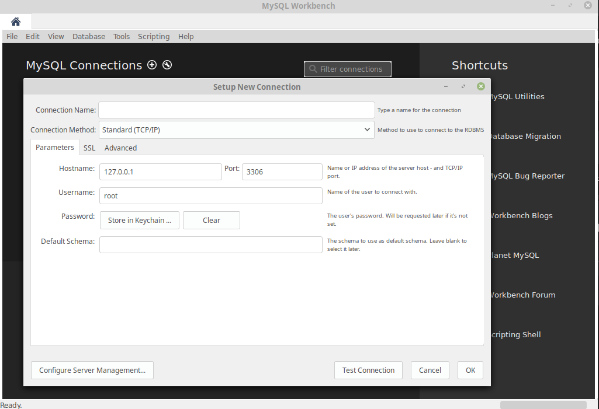

# 🌱 Project ...

```
- Implementando uma Rest Api com Spring;
- Persistência;
- Bean Validation;
- Exception Handler;
```

## - 🔭 Tools ...
- Tecnologias utilizadas :
```
- OpenJDK 11
- Spring Tools Suite
- Springframework
- Springboot
- Spring Web
- Hibernate Validator
- MySQL Driver
- Spring Data JPA (ajuda a criar repositórios com o jakarta persistence) Um repositório é uma classe que tem como responsabilidade implementar métodos que fazem as operações de persistência de dados;
- Flyway Migration
- Message Source (Interface do Spring para resolver mensagens)
- Postman
- MySQL Server
- Worckbench
- Docker
```

## Install OpenJDK

- Instalação do OpenJDK-11

```
$ sudo apt-get install openjdk-11-jdk
```
- Verificando a versão do Java
```
$ java -version
```



- Configurando as variáveis de ambiente do JAVA
```
$ echo "JAVA_HOME=/usr/lib/jvm/java-11-openjdk-amd64/" >> /etc/environment
$ source /etc/environment
```
- Checando o valor da variável de ambiente
```
$ echo $JAVA_HOME
```

## Install Spring Tools SUit 4


- Download https://spring.io/tools latests
- Descompacte no diretorio desejado e execute o arquivo SpringToolSuite4;



## Install Postman
- Acesse https://www.postman.com/downloads/ e baixe o instalador da sua versão;



## Install MySQL Server

- Foi utilizado um banco de dados MySQL dockerizado;
- Foi criado um Dockerfile com uma vairável de ambiente MYSQL_ROOT_PASSWORD;
```
FROM mysql:5.7
LABEL MANTAINER "leonardoviana00@hotmail.com"
ENV MYSQL_ROOT_PASSWORD 123456 
```
- Build da imagem docker
```
docker build -t db-mysql .
```
- Subindo a imagem
```
docker run -d -v $(pwd)/data:/var/lib/mysql --rm --name mysql-spring -p 3306:3306 db-mysql
```
## Install MySQL Workbenck

- Link para download da ferramenta: https://dev.mysql.com/downloads/



- Crie uma conexão com o banco criado anteriormente;
- Utilize a porta do host que foi mapeada com a do container, no exemplo ficou a 3306 mesmo;
- Utilize a senha root definida no Dockerfile;
- Teste a conexão.